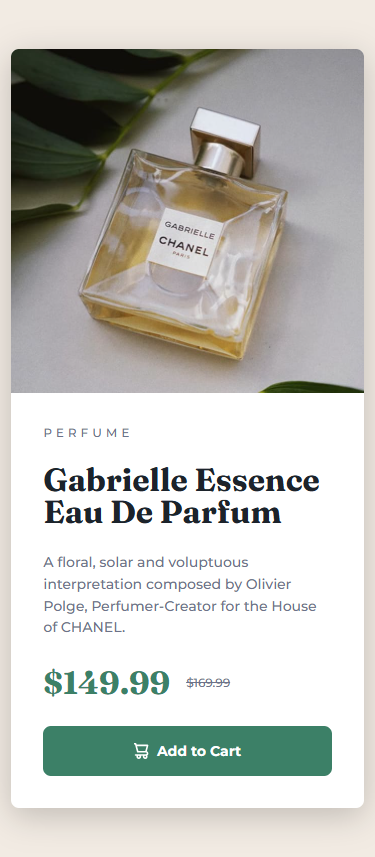

# Frontend Mentor - Product preview card component solution

This is a solution to the [Product preview card component challenge on Frontend Mentor](https://www.frontendmentor.io/challenges/product-preview-card-component-GO7UmttRfa). Frontend Mentor challenges help you improve your coding skills by building realistic projects. 

## Table of contents

- [Overview](#overview)
  - [The challenge](#the-challenge)
  - [Screenshot](#screenshot)
  - [Links](#links)
- [My process](#my-process)
  - [Built with](#built-with)
  - [What I learned](#what-i-learned)
  - [Useful resources](#useful-resources)
- [Author](#author)

## Overview

### The challenge

Users should be able to:

- View the optimal layout depending on their device's screen size
- See hover and focus states for interactive elements

### Screenshot

Mobile - 375px



Desktop - 1440px


### Links

- [Github Repo](https://github.com/Leondvin/product-preview-card-component-main-solution)
- [Live Site URL - Github Pages](https://leondvin.github.io/product-preview-card-component-main-solution/)

## My process

### Built with

- Semantic HTML5 markup
- CSS custom properties (variables)
- Flexbox
- CSS Grid
- Mobile-first workflow
- At-rule, `@font-face`
- Non-synthesized fonts
- Fluid typography using `clamp()`
- Logical properties
- Responsive image
- Media feature, `hover`

### What I learned

I used the `@font-face` at-rule to embed the local fonts. By using the `font-weight` and `font-style` descriptors, I indicated font weight range and styles being used. This improves the load time by filtering the fonts being used.

```css
@font-face {
  font-family: 'Montserrat';
  src: url('./assets/fonts/Montserrat/Montserrat-VariableFont_wght.woff2');
  font-weight: 500 700;
  font-style: normal;
}
```

---

When an out of scope `font-weight` or `font-style`, or a missing font file is used, browser fakes the style. This is called **font synthesis**. Fake fonts don't look as appealing as their true counterparts.

> Browsers fake fonts by default, to turn off this behavior the `font-synthesis` shorthand property could be used.

```css
:root {
  /* CSS rules */
  font-synthesis: none;
}
```

---

The `clamp()` function "clamps" the `font-size` range and responsively adjusts it depending on the size of the viewport.

It takes 3 parameters: a **minimum** value, a **preffered** value, and a **maximum** value.

```css
:root {
  /* CSS rules */
  --fluid: clamp(1rem, .75rem + 1vw, 1.25rem);
  --clamp-p-body: calc(var(--fluid) * .875);
  --clamp-p-new-price: calc(var(--fluid) * 2);
  --clamp-p-old-price: calc(var(--fluid) * .75);
  --clamp-h1: calc(var(--fluid) * 2);
  --clamp-h2: calc(var(--fluid) * .75);
  --clamp-button: calc(var(--fluid) * .875);
  /* CSS rules */
}
```

---

The writing mode affects some properties' affected axes. We generally assume left-to-right writing mode when we think of the terms **width**, **height**, **left**, **top**, **right**, **bottom**. But they may represent different directions or axes depending on the writing mode.

Using **logical properties** eliminates that confusion.

`margin-left` &rarr; `margin-inline-start`

`margin-right` &rarr; `margin-inline-end`

`margin-top` &rarr; `margin-block-start`

`margin-bottom` &rarr; `margin-block-end`

```css
.product-image {
  max-inline-size: 100%;  /* max-width: 100%; */
  block-size: auto;  /* height: auto; */
  /* CSS rules */
}
```

---

The `<picture>` parent element has the `<source>` and `` elements as its children. Inside `<source>`, the link to the desktop image and the media query of `(min-width:37.5)` were given as the values of the `srcset` and `media` attributes respectively. If the media condition is met, the image overrides the image provided inside ``. If it's not met, the image inside `` is used.

To allocate an area to the image, `width` and `height` attributes must be given. This prevents **layout shift** when the page loads before the image.

The `alt` attribute must be given to **inform the assistive technology** that whether the image is decorative or meaningful, and what it shows, if it's meaningful.

> For decorative images even an empty `alt` should be provided.

The `loading` attribute provides an information to the browser that it should load the image, whether regardless of the image's position, `eager`, or when the image is near / within the viewport, `lazy`.

The `decoding` attribute provides an information to the browser that whether it should decode the image along with rendering of other DOM content, `sync`, or wait for the page rendering before decoding the image, `async`.

```html
<picture>
  <source srcset="./assets/images/image-product-desktop.jpg" media="(min-width:37.5rem)">
  
</picture>
```

---

The `hover` **media feature** tests whether the user's primary input mechanism can hover over elements.

```css
@media (hover: hover) {
  button:hover {
    background-color: var(--color-green-700);
  }
  button {
    transition: background-color 0.2s ease;
    cursor: pointer;
  }
}
```

### Useful resources

- [web.dev - Responsive images](https://web.dev/learn/design/responsive-images)
- [web.dev - The picture element](https://web.dev/learn/design/picture-element)
- [mdn - Logical properties for sizing](https://developer.mozilla.org/en-US/docs/Web/CSS/Guides/Logical_properties_and_values/Sizing)

## Author

- Github - [@Leondvin](https://github.com/Leondvin)
- Frontend Mentor - [@Leondvin](https://www.frontendmentor.io/profile/Leondvin)
